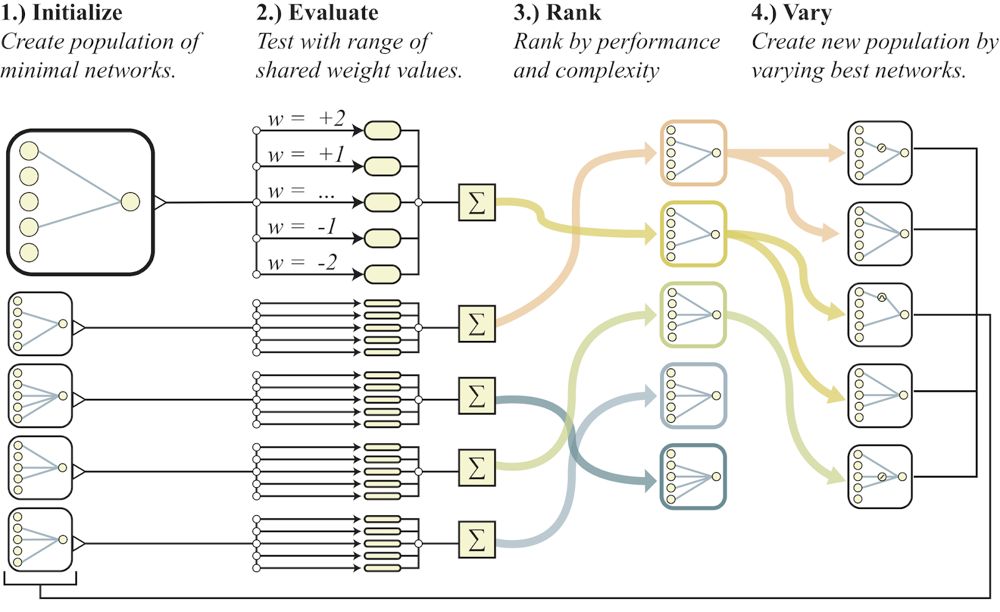
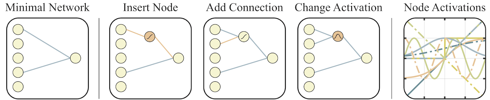

## Weight Agnostic Neural Networks  

#### Abstract 

weight parameter가 architecture에 비해 얼마나 더 중요한지에 대한 의문심을 제기하고 있음 

어떠한 weight parameters를 학습하지 않고, 어느 정도의 architecture만을 가지고 특정한 task를 수행할 수 있는지에 대한 궁금증을 가지게 됨  

-> __explicit weight training을 하지 않고, task를 수행할 수 있는 neural network architectures를 찾는 search method를 제안하는 논문__        

#### 1 Introduction    

motivation: 태어나고 얼마 있지 않은 후에 오리들이 헤엄칠 수 있고 turkeys들이 predators를 시각적으로 인식할 수 있음. (태어나고 어떠한 학습이 이루어지지 않았음에도 불구하고 특정한 task를 수행할 수 있음)    

트레이닝 과정에서, 네트워크는 single shared weight value 를 사용함.  

몇십년 간 도메인에 따라서 적용할 수 있는 모델들이 달랐음: 이미지 분야에서는 CNN, 시계열에서는 RNN이나 LSTM. (각 모델들이 하나의 task밖에 수행하지 못한다는 의미인 것 같음)   -> WANN을 통해서 random weights에 대해서 various tasks를 수행하고자 하였음    

Q: Inductive biases가 정확히 무슨 의미?   

여하튼 weight의 중요성을 강조하지 않으면서 architecture을 찾고자 하였음. 

__적용한 원칙__   

1) assignining a __single shared weight parameter to every network connection__       

2) evaluating the network __on a wide range__ of this single weight parameter       

=> fixed network(네트워크의 architecture가 고정)에서 weight를 optimize하는 것 대신에, 다양한 범위를 가진 weight 내에서 잘 perform할 수 있는 network architecture가 되도록 optimize하겠다   

논문에서 제안한 search method를 MNIST 데이터를 이용해서 supervised learning domain에 적용해 보았는데,

test accuracy가 92% 이상이었음    

논문에서 제안한  search method는 gradient-based method가 아니라는 점에 의의가 있음.    

#### 2 Related Work    

__1. Architecture Search__     

논문 method는 NEAT, an established topology search algorithm에 근거하고 있음. -> weight랑 structure of networks를 동시에 optimize 시킬 수 있음   

__cf) NEAT 알고리즘__  

genetic algorithm의 일종인데, weight parameters와 structures of networks를 동시에 바꿀 수 있음  

3가지 techniques에 근거하는데, 

tracking genes with history markers to allow crossover among topologies     

applying speciation (the evolution of species) to preserve innovations    

developing topologies incrementally from simple initial structures ("complexifying")  

#### 3 Weight Agnostic Neural Network Search  

creating network architectures which encode solutions(아마도 논문에서 제안하는 방법론을 지칭하는 게 아닐까 싶음. encode solutions라는 게 특정 task를 수행할 수 있게 한다는 의미라고 해석하였음) 는 NAS와는 다른 문제이다.   

NAS의 목적은 인간이 디자인한 architecture보다, __트레이닝 시__ 더 좋은 성능을 내는 architectures를 만들어 내는 것.  -> 결국 training을 해야 함.     

weight를 random distribution에서 얻어내는 것은, 특정 task의 performance가 오직 network topology 에 의한 것이라고 보장할 수 있음 

__The Search for these weight agnostic neural networks(WANNs)__    

        

1) An initial Population of minimal neural network topologies is created

2) each network is evaluated over multiple rollouts, with a different shared weight value assigned to each rollout  

3) networks are ranked according to their __performance__  and __complexity__      

4) new population is created by varing the highest ranked network topologies, chosen probabilistically through tournament selection   

2)번부터 다시 알고리즘이 반복되며, 점차적으로 complexity랑 performance를 증가시킴.    

__Topology Search__   

네트워크 구조의 탐색에 관한 아이디어를 NEAT로부터 얻었음.   

NEAT는 weight와 architecture를 동시에 optimize할 수 있는데, 본 논문에서는 weight를 무시하고 

topological search operators에만 집중( architecture에만 집중했단 뜻 )    

  

시작: connection이 거의 없고, hidden nodes 없이 input nodes와 output node 만 있는 상태에서 시작함   

네트워크 구조를 변형시키는 3가지 방법: Insert Node, Add Connection, Change Activation  

-  Insert Node: connection을 둘로 쪼갬 (single shared parameter value이기 때문에 weight 값은 그냥 이전과 동일함 )  
- Add Connection: 이전에 연결되어 있지 않던 두 노드를 이음.  
- Change Activation: hidden nodes에 랜덤하게 activation function 할당   ex) linear, sigmoid, ReLU, Gaussian, sinusoid, step 등   

__Performance and Complexity__   

각 rollout에서는 모든 connection에 대해서 같은 weight값을 가짐. 대신 여러 개의 rollouts를 이용해서

네트워크 구조를 평가하였음.  

본 논문의 실험에서는 evaluations 사이의 variance를 감소시키기 위하여, 5가지의 고정된! weights 를 사용하였음 = [-2, -1, -0.5, +0.5, +1, +2]   

이 5가지의 다른 weight values를 사용한 모든 rollouts에 대한, cumulative reward를 평균냄으로써 네트워크의 mean performance를 계산하였음.   

만약에 비슷한 performance를 내는 두개의 다른 networks가 있따면, 우리는 둘 중 simpler network(network size가 작은것)를 더 선호함.     

__population(네트워크 구조들) 내에서 ranking을 할 때, performance 뿐 만 아니라 size of network도 고려해야 함__     

ranking시? 3가지 평가 기준 - 1)mean performance over all weight values, max performance of the single best weight value, number of connections in the network    

performance를 올리다 보면 어쩔 수 없이 complexity가 증가하게 되는데, complexity를 줄이는 걸 너무 과도하게 고려하다 보면 구조적으로 많은 변형이 이루어져야 하기 때문에, 이것은 이루어지기 어려움.   

그래서 적당히 complexity 감소를 고려하는 방안으로, 오직 확률적으로 complexity를 랭킹하고자 하였음

: 80%는 mean performance와 number of connections를 이용해서 ranking하고, 20%는 mean performance와 max performance를 활용하여 랭킹한다.       

#### 4 Experiment Results       

__Continuous Control__     

WANN이 3가지 continuous control tasks에 의해서 평가가 되는데, 다음과 같다.

- CarPoleSwingUp  

         

  차가 트랙의 경계선을 넘지 않도록 운전. 

- BipedalWalker - v2    

       

  두 개의 다리를 가진 agent가 무작위로 생성된 지형 위를 걸어가는 것. reward는 agent가 travel한 distance가 됨. 

- CarRacing - v0    

        

  car은 3가지의 움직임을 할 수 있음 (gas, steer, brake) -> 정해진 시간 내에 무작위로 생성된 track에서 가능한 한 많은 tiles를 방문하는 것    

  

  Q: 여기서 pixel representation을 VAE를 통해 차원축소해서 16 latent dimensions로 합축한다고 했는데,

  이게 "network의 input으로 들어간다" 고 되어있는 데 그게 이해가 안감. 무슨 소리?   

  

weight의 범위가 (-2,2)인 이유는 3이상으로 되면 activation function에서 기울기가 0에 ㄱ까워져서 saturated 되고, 그 결과 여러 네트워크들이 비슷하게 perform하는 경향이 커진다고 함.  -> (-2, 2)구간 내에서 performance의 variance가 커짐.    

100 random trials라는 건 U(-2, 2) 사이에서 100번 랜덤 샘플링 했다는 뜻인듯   

__Classification__     

__Reference__       

[wann 정리 document 1](<https://towardsdatascience.com/weight-agnostic-neural-networks-fce8120ee829>)     

[wann 정리 document 2](<https://weightagnostic.github.io/>)   

[google AI document](<https://ai.googleblog.com/2019/08/exploring-weight-agnostic-neural.html?fbclid=IwAR3G6pvTEsFf-1AUSrIh1iCjnaOnzlQgRh9BSZjANjMMkZDApwx50SeEA-Y>)  

[NEAT 위키피디아](<https://en.wikipedia.org/wiki/Neuroevolution_of_augmenting_topologies>)   

